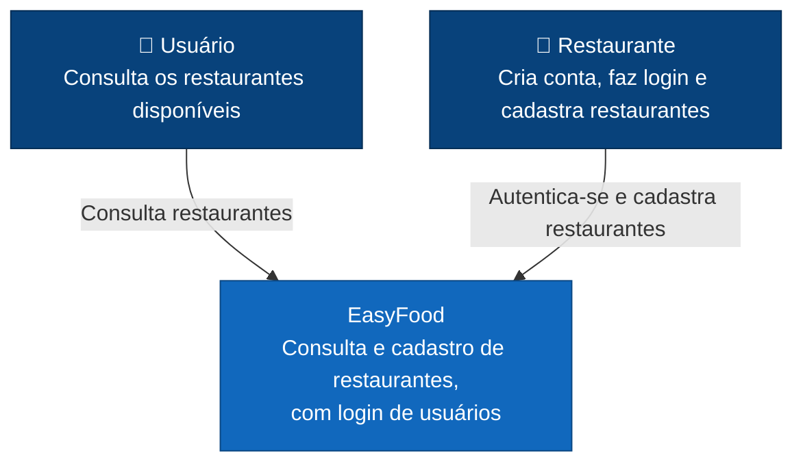
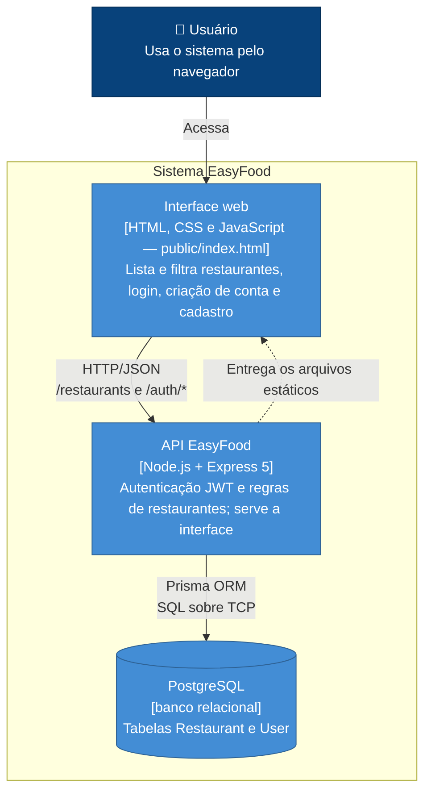
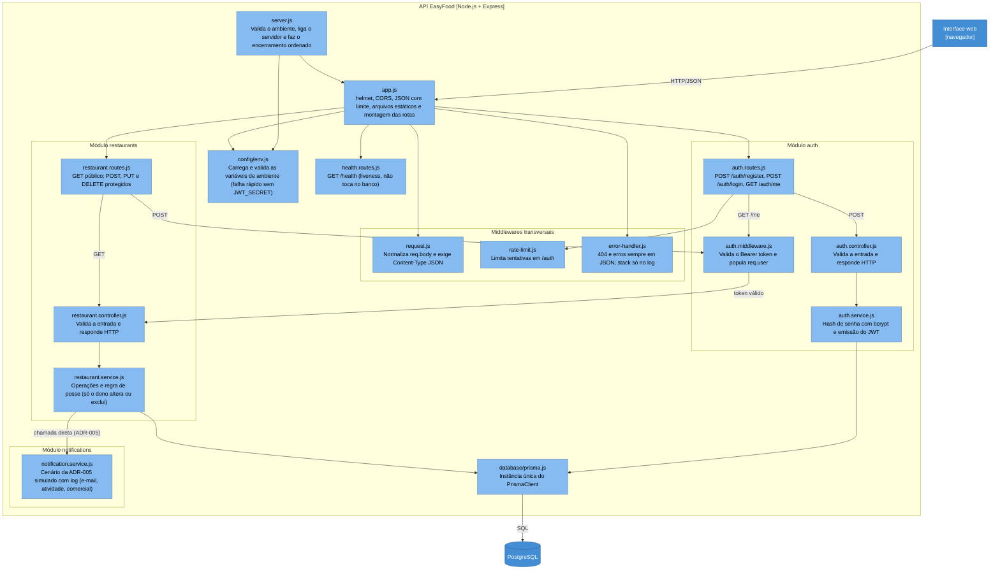
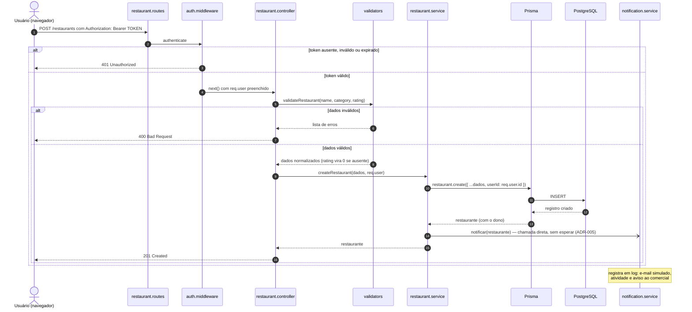

# Arquitetura da EasyFood — Modelo C4

Este documento descreve a arquitetura da EasyFood nos três primeiros níveis do [modelo C4](https://c4model.com/), do mais geral ao mais detalhado. O quarto nível (Code) é o próprio código-fonte em [`src/`](../../src/).

Os diagramas usam [Mermaid](https://mermaid.js.org/), que o GitHub renderiza automaticamente.

As decisões por trás desta arquitetura estão registradas nos [ADRs](../adr/):

- [ADR-002](../adr/ADR-002-persistencia-com-postgresql.md) — PostgreSQL como banco de dados
- [ADR-003](../adr/ADR-003-arquitetura-em-camadas.md) — monólito modular em camadas
- [ADR-004](../adr/ADR-004-autenticacao-com-jwt.md) — autenticação com JWT
- [ADR-005](../adr/ADR-005-comunicacao-direta-sem-eventos.md) — comunicação direta entre módulos, sem eventos por ora

---

## Nível 1 — Contexto

**Quem usa o sistema e com o que ele se relaciona?**

A EasyFood é usada por pessoas que consultam restaurantes e por restaurantes (usuários autenticados) que se cadastram. Nesta versão não há integração com sistemas externos.

---

## Nível 2 — Contêineres

**Quais aplicações e armazenamentos formam o sistema?**

A interface web é servida pelo próprio Express (`express.static`), então interface e API compartilham a mesma origem e o mesmo deploy. Em desenvolvimento, o PostgreSQL roda via [`docker-compose.yml`](../../docker-compose.yml).

---

## Nível 3 — Componentes (API EasyFood)

**Como a API está organizada internamente?**

A API segue o fluxo `routes → controller → service → database` (ADR-003). O middleware de autenticação é reaproveitado por qualquer módulo que precise proteger rotas (ADR-004).

Os componentes transversais — configuração, middlewares e tratamento de erro — foram acrescentados na manutenção de setembro/2026 (ver [`docs/manutencao.md`](../manutencao.md)). Eles não alteram o fluxo das camadas: apenas cercam a aplicação de forma que nenhuma requisição chegue ao controller sem passar pela validação de ambiente, de formato e de tamanho, e que nenhuma resposta de erro saia fora do formato JSON.

---

## Nível 4 — Código

O nível 4 é o próprio código em [`src/`](../../src/). Para complementar, o diagrama abaixo mostra o caminho de uma requisição protegida: o cadastro de um restaurante.

---

## Manutenção

Atualize estes diagramas quando uma decisão arquitetural mudar a estrutura do sistema (novo módulo, novo contêiner, novo serviço externo) e registre a decisão em um novo ADR.
